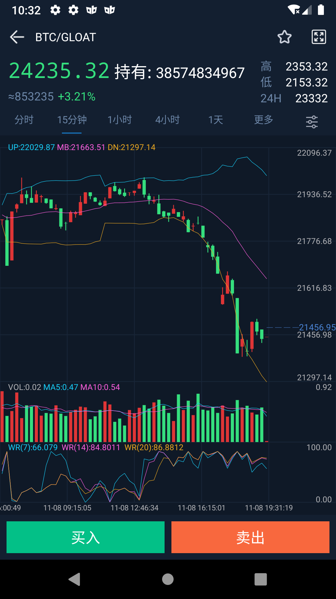
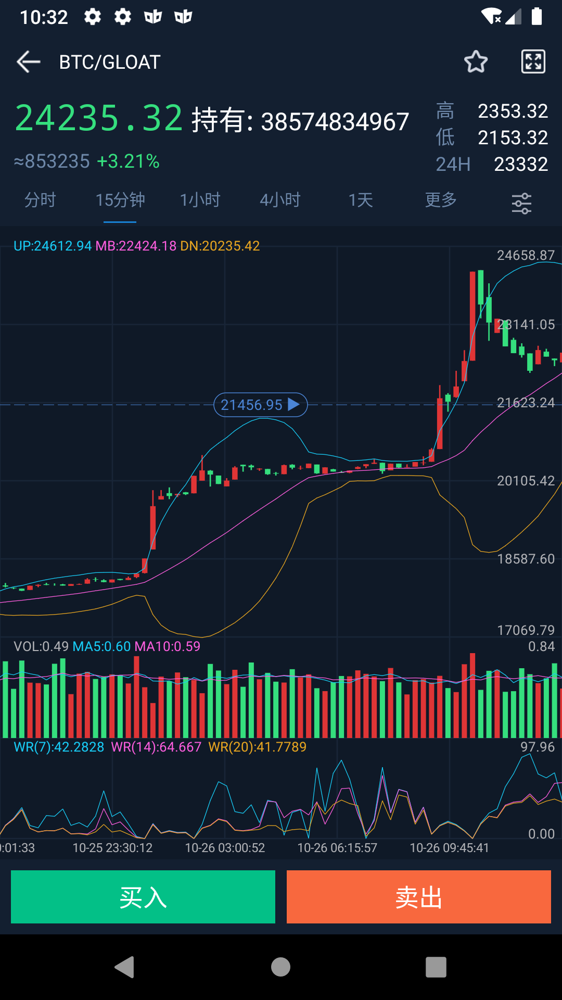
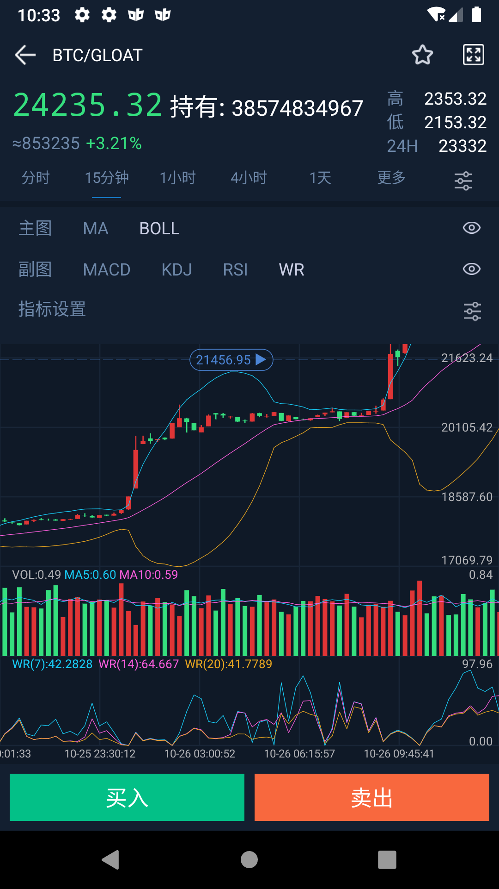
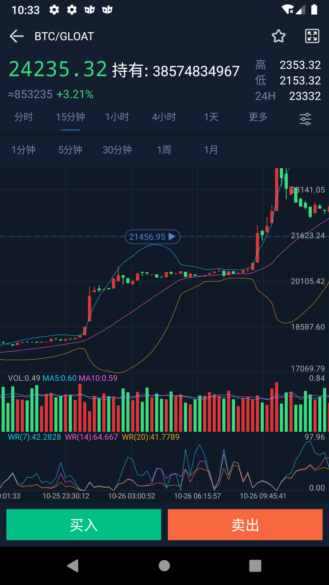
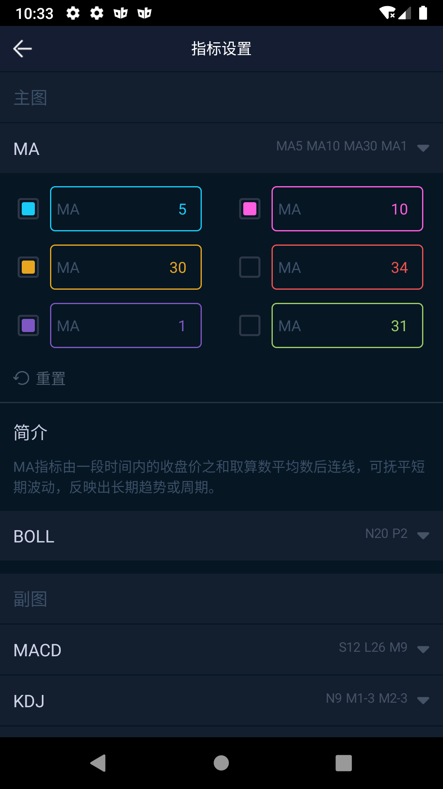
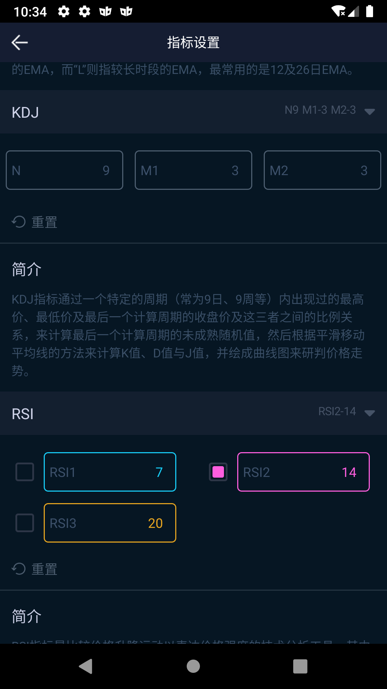
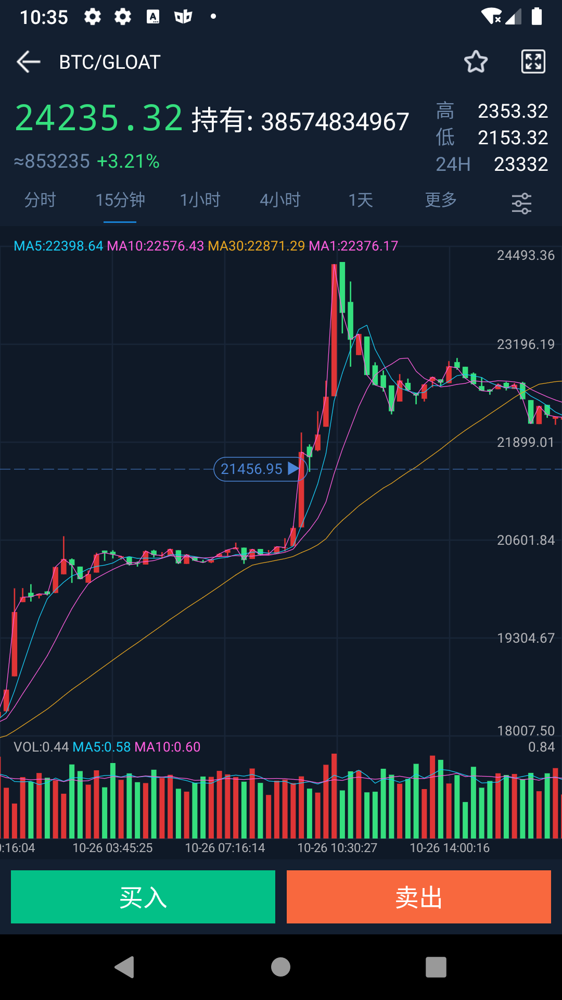
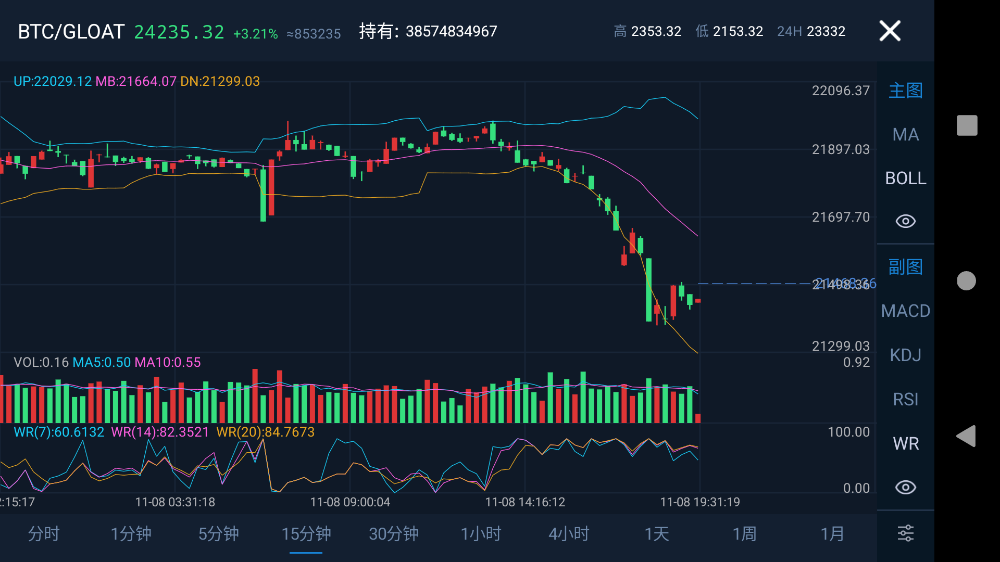
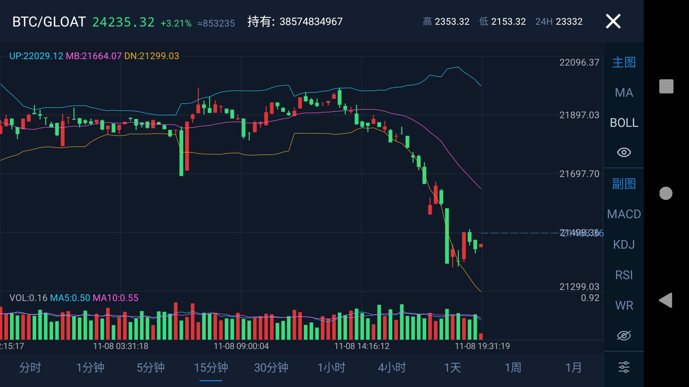
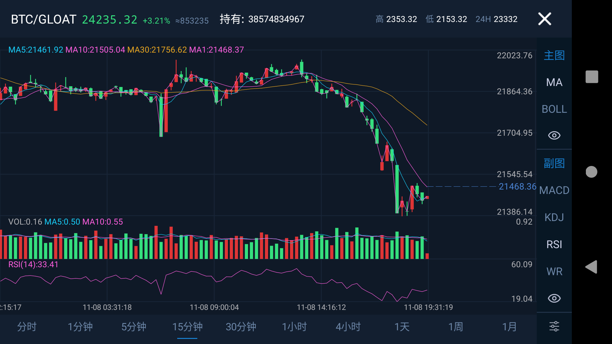

### Use:
```groovy
	allprojects {
		repositories {
			...
			maven { url 'https://jitpack.io' }
		}
	}
```

```groovy
dependencies {
	        implementation 'com.github.cat-x:KChart:0.10'
	        implementation 'com.github.cat-x:LStorage:0.20'//请根据自己版本来集成
	        implementation 'androidx.core:core-ktx:1.2.0-beta01'//请根据自己版本来集成
	        implementation 'org.jetbrains.kotlinx:kotlinx-coroutines-android:1.3.2'//请根据自己版本来集成
	}
```
##### 具体编码：
***请继承ConfigKChartView***
```kotlin
class SimpleKChartView : ConfigKChartView {

    override fun onRefreshData(
        onLoadSuccess: (data: List<BaseKLineEntity>, isHasNext: Boolean) -> Unit,
        onLoadFail: (tip: () -> Unit) -> Unit
    ) {
    //数据加载成功请调用onLoadSuccess
    //数据加载失败请调用onLoadFail
    }


    override fun onSwitchTime(oldTime: Long, newTime: Long) {
       //切换分时选择
    }
}
```


### 特点:
1. 全部数据可配置
2. 可以接入动态实时数据
3. 使用超简单
4. 目前已经实现MA、MACD、KDJ、BOLL、WR、RSI、VolumeMA、分时图等K线

### Image:
* 竖屏K线示例1  

* 竖屏K线示例2  

* 竖屏配置分时选择  

* 竖屏配置指标选择  

* 指标配置  

* 指标配置  

* 竖屏K线无副图  

* 横屏K线示例1  

* 横屏K线示例2  

* 横屏K线示例3  



